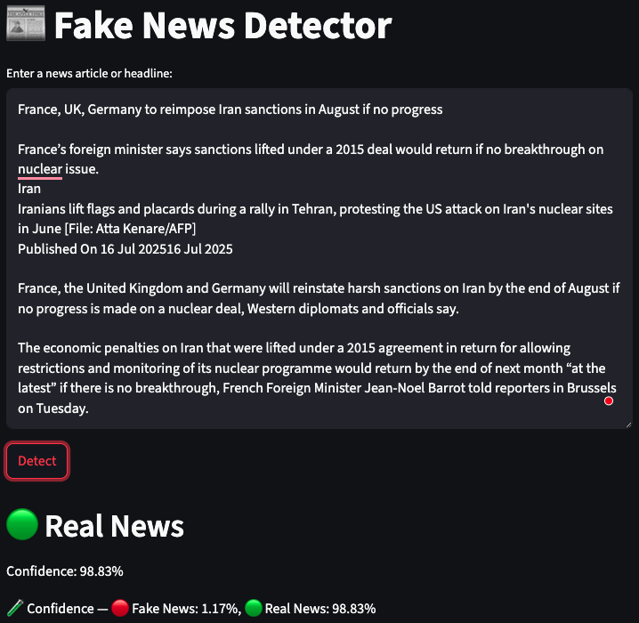
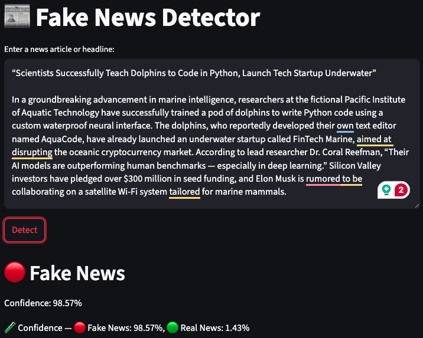

# 📰 Fake News Detection using Traditional ML and BERT
This project detects fake news articles using two approaches:
- ✅ Classical machine learning models (e.g., Logistic Regression, Random Forest)
- 🤖 Transformer-based deep learning with BERT

The goal is to compare the performance of these methods and build a robust fake news classification system using real-world data.

## 📁 Dataset

The full dataset is available on [Kaggle](https://www.kaggle.com/datasets/clmentbisaillon/fake-and-real-news-dataset).

We use a labeled public dataset containing **real** and **fake** news articles. The dataset has two separate CSV files:
- `Fake.csv`: Fake news articles with columns like `title` and `text`
- `True.csv`: Real news articles

Each file is preprocessed and labeled:
- `0`: Fake news
- `1`: Real news
## ⚙️ Methodology
1. **Data Preprocessing**: Clean and prepare the text data for analysis.
   - Combine title and text fields into a single content column
   - Clean text using: Lowercasing, Removing punctuation/numbers, Removing stopwords and Stemming
2. **Classical ML Pipeline**
    - Split data into training and test sets
    - Vectorize text using TF-IDF
    - Train models: Logistic Regression, Random Forest, SVM, Naive Bayes
    - Evaluate performance using accuracy, precision, recall, F1-score

3. **BERT Pipeline**:
    - Used bert-base-uncased
    - Tokenized text with truncation and padding
    - Fine-tuned BERT model on the dataset using `TFBertForSequenceClassification` with:
        - Batch size of 16
        - Learning rate of 2e-5
        - Epochs: 3
    - Model trained using `SparseCategoricalCrossentropy`

## 🚀 Web App (Streamlit)
A minimal Streamlit interface (app.py) lets users interactively test news headlines or articles.

How it works:
- User inputs a news article
- Model predicts whether the news is real or fake
- Shows confidence score and class probabilities

Sample Output:

## 🧪 Results
| Model               | Accuracy |
|---------------------|----------|
| Random Forest       | 99.78 %  | 
| Logistic Regression | 99.31 %  |
| Naive Bayes         | 93.46 %  |
| BERT (Fine-tuned)   | 99.89 %  |

## 📦 Installation
# Clone the repo
git clone https://github.com/alaaasfour/fake-news-detection.git

`cd fake-news-detection`

1. (Optional) Create a virtual environment

`python -m venv .venv`

`source .venv/bin/activate`  # For Linux/Mac

`.venv\Scripts\activate`     # For Windows

2. Install dependencies

`pip install -r requirements.txt`

3. Run Streamlit app

`streamlit run app.py`